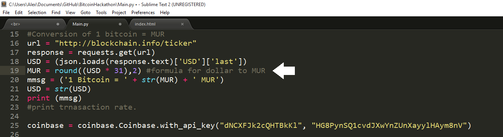
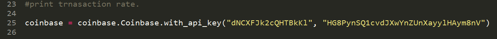
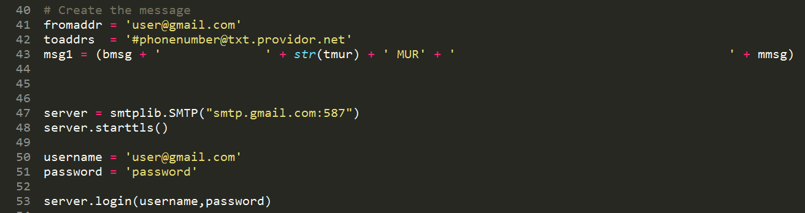

<br>
<p align="center">
  

  <br>
  SMS implimentation where you send a message to your email address to receive your online Coinbase wallet and a real time transaction rate.
  <br>
  <br>
  <br>


<br>
</p>
## Installing Coinbase and Libraries
 ```shell
 sudo pip install Coinbase
```
 <br>
 <br>
 The code also has additional libaries, most of which will need to be installed. Extra libaries can be installed as such
```shell
sudo pip install "library"
 ```
 <br>
 </p>
## Changing Variables
  
  <br>
  In original code for the Hackathon, we converted to MUR based off the dollar. To conver to any other currency, do your currency times conversion rate of other currency.
  <br>
  <br>
  <br>

  
  <br>
  Change the api key linked to the coinbase wallet to your api wallet key.
  <br>
  <br>
  <br>

  
  <br>
  Here you link your number and email. Realize your service providor may be different when sending a message to an email account. 

  


</p>
## Usage
Currently the program only works if you run it off terminal and leave it looping. While it loops, if you send a text message to your email,
you will recieve your account balance back. 
</b>

</p>
## Future plans
I hope to create a server to actually recieve in messages from the phone and get rid of the email system that is set up currently.
